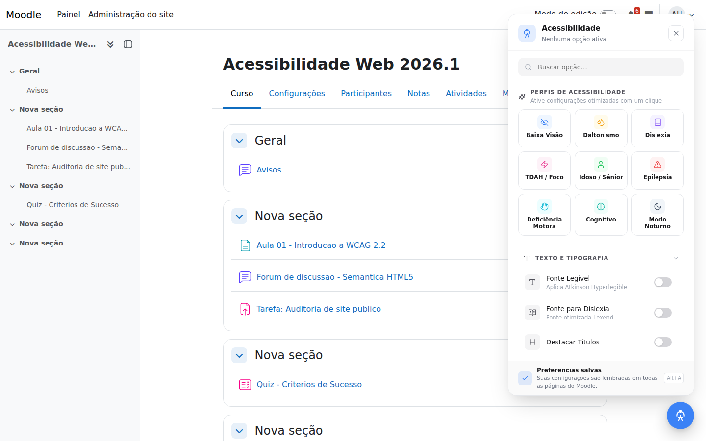
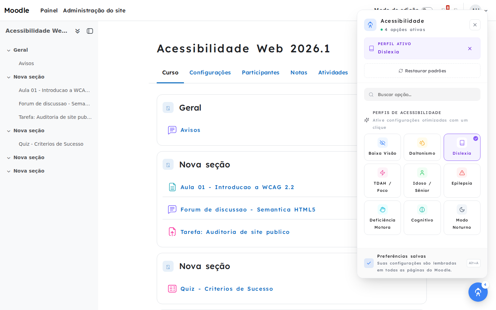
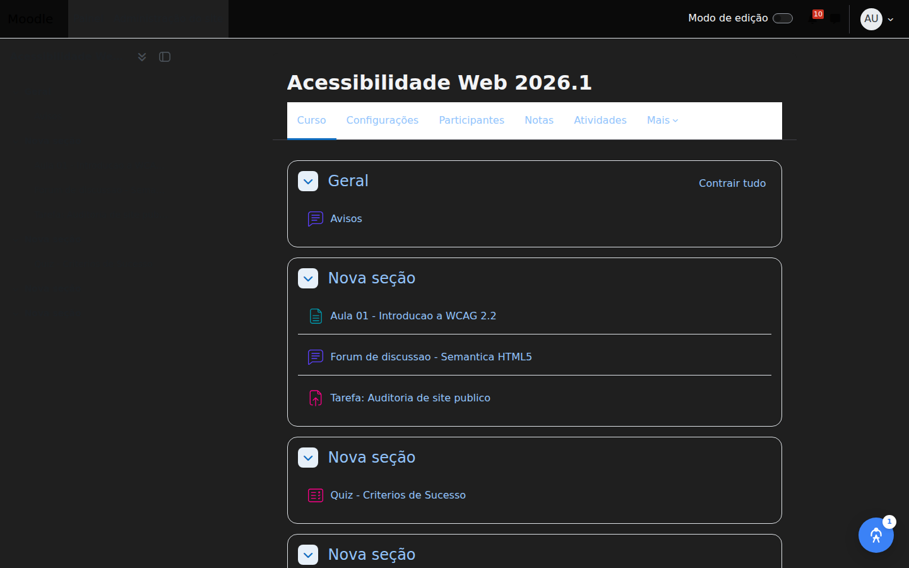
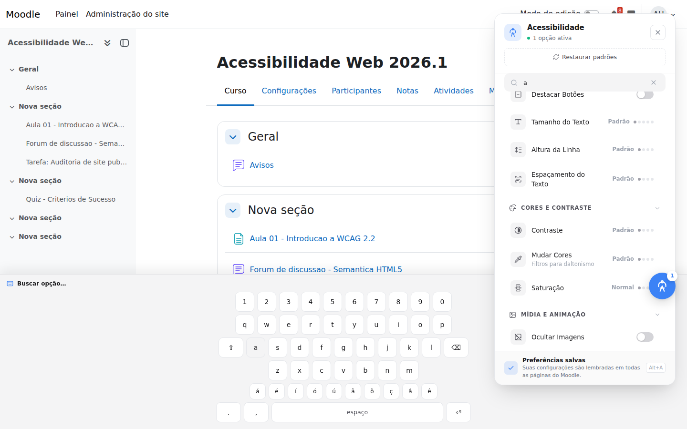
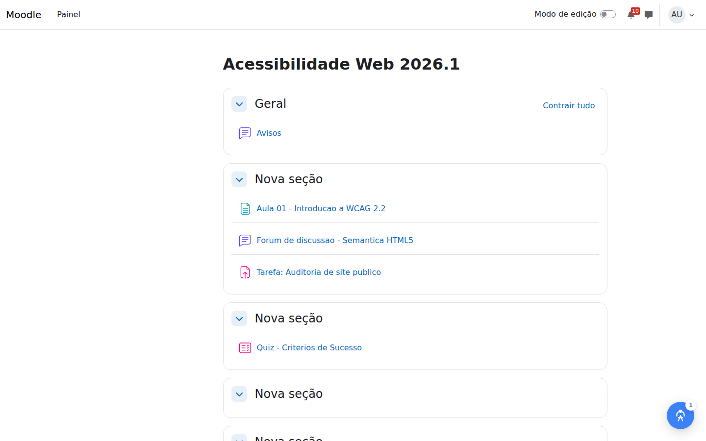

# A11Y for Moodle - Plugin de Acessibilidade para Moodle

[](https://www.gnu.org/licenses/gpl-3.0.html)
[](https://moodle.org)
[](https://www.php.net)
[](docs/README.md)

Um plugin de acessibilidade para Moodle 5.0+ que adiciona um botão flutuante (FAB) e um painel com **24 opções de acessibilidade** organizadas em 5 categorias e **9 perfis prontos**, disponível em qualquer página do site. 



## Autoria

Desenvolvido por dois servidores públicos federais da Universidade Federal de Pelotas (UFPel):

- **Rodrigo Padilha Silveira** — <padilhars@gmail.com>
- **Jerônimo Medina Madruga** — <jeronimo.madruga@gmail.com>

## Motivação

O Moodle não oferece, nativamente, um conjunto abrangente e granular de ferramentas de acessibilidade que o próprio usuário final possa ativar e ajustar em qualquer página, independentemente do tema instalado. Como instituição pública federal, a UFPel tem a responsabilidade — reforçada pela Lei Brasileira de Inclusão (Lei nº 13.146/2015) e pelo eMAG (Modelo de Acessibilidade em Governo Eletrônico) — de garantir que seu ambiente virtual de aprendizagem seja utilizável pela maior parcela possível da comunidade acadêmica, incluindo pessoas com deficiência visual, auditiva, motora e cognitiva.

O `local_a11y` nasceu para preencher essa lacuna: uma camada de personalização de acessibilidade nativa do Moodle, sob controle do próprio usuário, sem depender de extensões de navegador de terceiros ou de temas customizados que exigiriam manutenção contínua e nem sempre cobririam todas as páginas e plugins instalados.

## Por que usar

- **Sem dependências externas em tempo de execução** — nenhum script, fonte ou API de terceiro é carregado do navegador do usuário final (as duas exceções — CDN do MediaPipe para Navegação por Face e o ícone ONU — estão documentadas e a primeira passa por verificação de integridade SHA-256 antes de ser executada).
- **24 opções reais, não uma lista de marketing** — cada uma foi implementada, testada em auditoria de segurança e código morto, e documentada (PHPDoc/JSDoc/KSS completos, ver [`docs/`](docs/README.md)).
- **Zero FOUC**: as preferências do usuário são aplicadas antes da primeira pintura da página, via script inline síncrono.
- **Privacidade real**: nenhuma tabela própria, nenhum dado compartilhado com terceiros — só a Privacy API padrão do Moodle.
- **Feito para produção**: controle de acesso via capabilities do Moodle (`local/a11y:view`), Hooks API (não callbacks legados), auditado quanto a segurança e código morto antes de cada publicação.

## Capturas de tela

<table>
<tr>
<td width="50%"></td>
<td width="50%"></td>
</tr>
<tr>
<td width="50%"></td>
<td width="50%"></td>
</tr>
</table>

## Requisitos

- Moodle 5.0 ou superior.
- PHP 8.2+.
- Nenhuma dependência externa em tempo de execução (as fontes Atkinson Hyperlegible e Lexend são empacotadas localmente; nada é carregado de CDNs de terceiros).

## Instalação

1. Extraia `local_a11y.zip` de forma que o diretório `a11y` fique em `<moodleroot>/local/a11y` (layout Moodle 5.0+: dentro do webroot, ou seja `<moodleroot>/public/local/a11y` se o seu checkout já usa a nova estrutura com `public/`).
2. Acesse **Administração do site → Notificações** para concluir a instalação, ou rode:
   ```bash
   php admin/cli/upgrade.php --non-interactive
   ```
3. Pronto — o botão de acessibilidade já aparece em todas as páginas para todos os usuários (inclusive visitantes, por padrão).

## O que o plugin faz

### Botão flutuante + painel

- Botão circular (ou quadrado) fixo, canto configurável, com contador de opções ativas.
- Painel com busca, perfis de acessibilidade, categorias colapsáveis e rodapé com atalho de teclado.
- **Atalho global `Alt + A`** abre/fecha o painel de qualquer página.
- Focus trap (WCAG 2.2), `Esc` fecha e devolve o foco ao botão, `aria-live` no contador de opções ativas.

### As 24 opções (5 categorias)

| Categoria | Opções |
|---|---|
| Texto e Tipografia | Fonte Legível, Fonte para Dislexia, Destacar Títulos/Links/Botões, Tamanho do Texto, Altura da Linha, Espaçamento do Texto, Alinhamento do Texto |
| Cores e Contraste | Contraste (4 níveis), Inverter Cores, Mudar Cores (filtros de daltonismo via SVG), Saturação |
| Mídia e Animação | Ocultar Imagens, Pausar Animações, Dicas de Ferramentas |
| Foco e Navegação | Guia de Leitura, Máscara de Leitura, Cursor (3 níveis), Modo Foco |
| Recursos Avançados | Leitor de Tela (texto-para-fala), Teclado Virtual, Comandos por Voz, Navegação por Face |

### Os 9 perfis

Baixa Visão, Daltonismo, Dislexia, TDAH/Foco, Idoso/Sênior, Epilepsia, Deficiência Motora, Cognitivo e Modo Noturno — cada um aplica um conjunto de opções otimizado com um clique (e reseta o restante).

### Persistência

- **Usuários logados**: preferência do usuário (`local_a11y_settings`), sincronizada em todas as páginas e dispositivos.
- **Visitantes**: `localStorage` do navegador, migrado automaticamente para a preferência do usuário no primeiro login.
- Aplicação **sem FOUC**: um script inline no topo do `<body>` aplica as classes de acessibilidade antes da primeira pintura da página.

## Configuração (administrador)

**Administração do site → Plugins → Plugins locais → Acessibilidade (A11y)**:

- Ativar/desativar o plugin globalmente; mostrar (ou não) para visitantes; padrões de URL a excluir.
- Quais das 24 opções ficam disponíveis para os usuários.
- Posição/ícone/forma do botão flutuante; formato do painel (popover/gaveta/modal); densidade; mostrar perfis; texto do rodapé do painel; cor de acento.

## Privacidade

O plugin implementa a Privacy API do Moodle (`classes/privacy/provider.php`): a única informação pessoal armazenada é a preferência `local_a11y_settings` do próprio usuário (suas opções de acessibilidade escolhidas). Nenhuma tabela de banco de dados própria; nada é compartilhado com terceiros. Visitantes usam apenas `localStorage` do navegador, fora do alcance do Moodle.

## Desenvolvimento

Ver [`docs/`](docs/README.md) para a documentação de API completa (phpDocumentor para PHP, JSDoc para os módulos AMD e um style guide KSS navegável para `styles.css`).

```bash
# Recompilar AMD após editar amd/src/*.js
npx grunt amd --root=local/a11y

# Testes PHPUnit
vendor/bin/phpunit --configuration local/a11y/phpunit.xml
```

## Licença

GNU GPL v3 ou posterior — ver `COPYING.txt` do Moodle.

### Atribuição de terceiros

`pix/accessibility-un.svg` (ícone padrão do botão flutuante) é uma cópia local de
["Accessibility logo (UN)"](https://commons.wikimedia.org/wiki/File:Accessibility_logo.svg),
Wikimedia Commons, licenciado sob
[CC BY-SA 4.0](https://creativecommons.org/licenses/by-sa/4.0/) (Creative Commons
Attribution-ShareAlike 4.0 International). A geometria (paths/circles) é idêntica ao
arquivo original; o único ajuste foi substituir o bloco `<style>`/classes CSS do
arquivo original por atributos de apresentação equivalentes aplicados diretamente
nos elementos, para que o SVG possa ser inserido com segurança inline na página do
Moodle (sem depender de nomes de classe CSS globais que poderiam colidir com outros
elementos da página). Ver `classes/icons.php::un_accessibility_svg()`.
